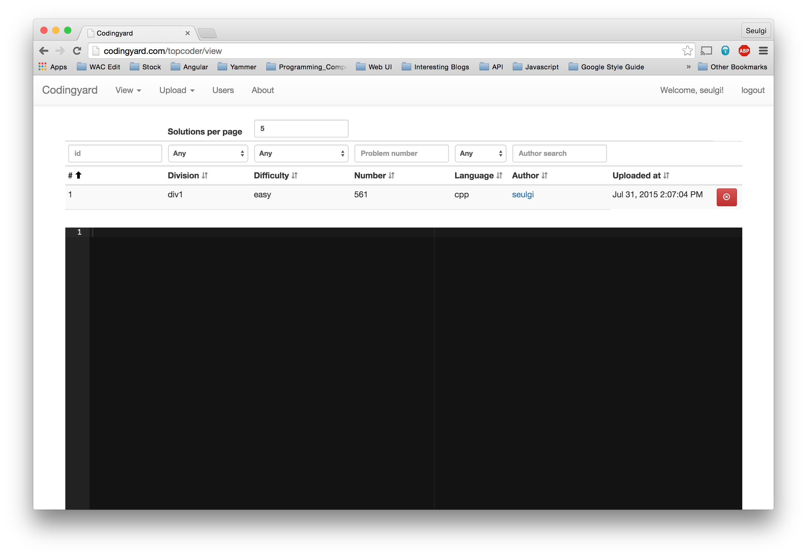
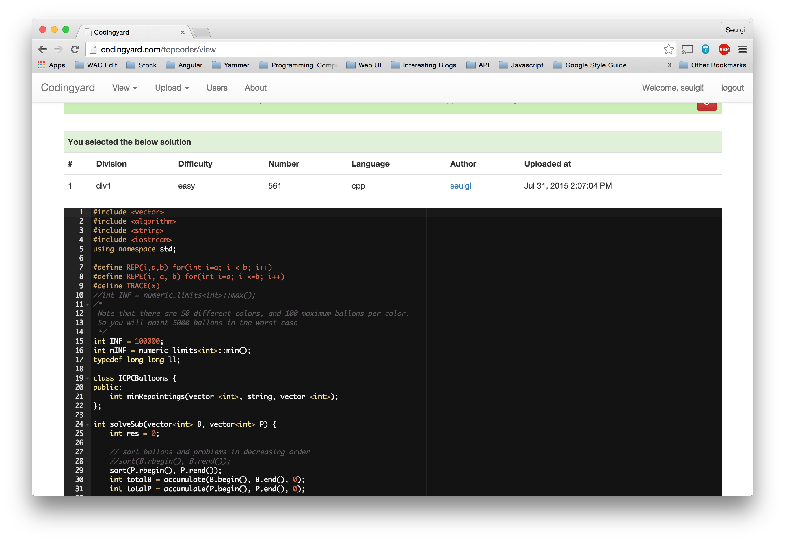
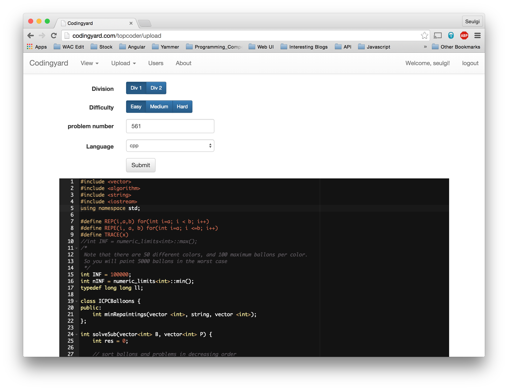
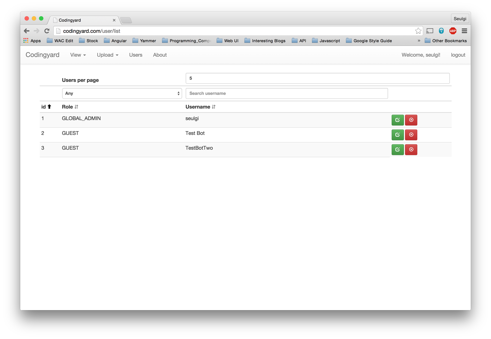

# This is deprecated.
After trying to a lot of tasks common to web development, such as user authentication, ORM, etc., I realized it is not worth it. It was a good learning experience, but not practical. I am re-writing this in RoR for velocity and better development cycle. The RoR version of CodingYard can be found [here](https://github.com/TurtleShip/CodingYard)

# Overview
This is a website for sharing solutions to coding competitions. It is hosted at [www.codingyard.com](http://www.codingyard.com), or you can host it yourself. Check out **[installation guide](docs/INSTALL_GUIDE.md)** if you want to host it yourself.

Also, check out **[manual](docs/MANUAL.md)** to learn how to manage CodingYard ( ex> user management ) and **[FAQ](docs/FAQ.md)** if you have questions.

# Features
## View solutions
You can **search uploaded solutions** by different criteria. When you specify criteria, CodingYard will return a set of results matching your criteria. You can **sort the results** using specific criteria as well, such as *by Author* or *by Uploaded At*. You can also click a specific entry from the results to see the full content of the solution you selected.

## Upload solutions
You can upload your own solution if you are a **member or above**. Guests are not allowed to upload solutions.

## User management
There are 4 different user levels : **Global admin**, **admin**, **member**, **guest**. When a user signs up, it becomes a guest. Details on user levels can be found in this [manual](docs/MANUAL.md). CodingYard provides a UI to manage users as shown below.

